 # ZSTU Beamer  
 
 **此PPT模板实在UCAS的模板基础上修改的，特别感谢 [UCAS Beamer](https://github.com/icgw/ucas-beamer) ，仅针对浙江理工大学修改。**

## 简介
* 简洁、优雅、严肃的 Beamer (LaTeX) 中文模板，供浙江理工大学大学本科生、硕士生、博士生、等科研工作者学习使用。如果你有任何疑问，无需犹豫，通过 [E-mail](mailto:guoxiaozhong1990@outlook.com) 联系我。

## 安装 TeX Live
* [官方安装](https://www.tug.org/texlive/)
* [清华大学开源软件镜像站](https://mirrors.tuna.tsinghua.edu.cn/CTAN/systems/texlive/)

## 在线使用
* 推荐：[Overleaf](https://www.overleaf.com) 在线 LaTeX 编辑器

## 使用方法
* 离线使用 (需要安装和配置 TeX 编译环境)
  - 方式一：安装完 TeX Live 之后，先用 `xelatex` 对 `main.tex` 编译一次 (生成文本内容和辅助文件)，再用 `biber` 编译一次 (通过辅助文件抽取文献引用信息)，最后用 `xelatex` 连续编译两次 (将引用标记插入文本内容、生成目录、添加链接等)
  - 方式二：`./build.sh main` (Linux 或 Mac)
* 在线使用 (无需安装 TeX 环境但需要连接至互联网)
  1. 下载此模板压缩包并上传至 Overleaf 的 Project
    - 模板 \[[下载](https://github.com/spartajet/zstu-beamer.git/releases)\]
    - `New Project` - `Upload Project` - `Select a .zip file`
  2. 编译方式选为 `XeLaTeX`
    - `Menu` - `Settings` - `Compiler` - `XeLaTeX`
    - `Recompile`

## 展示

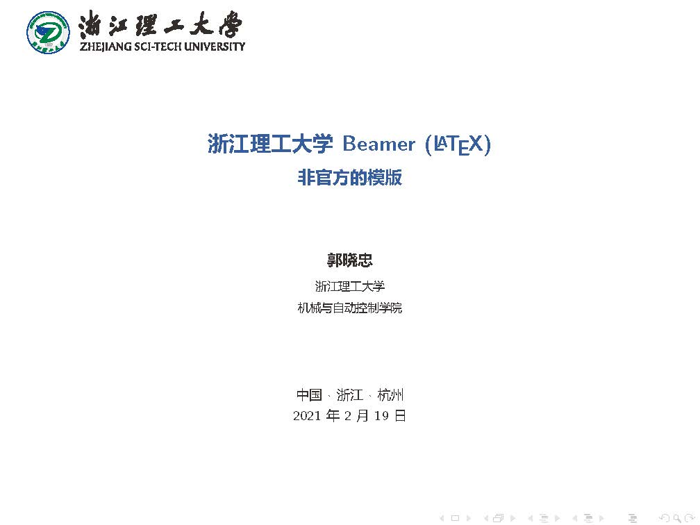
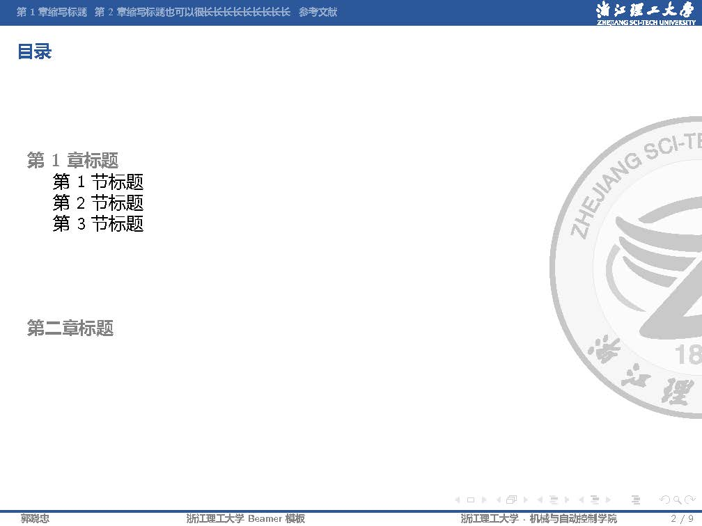
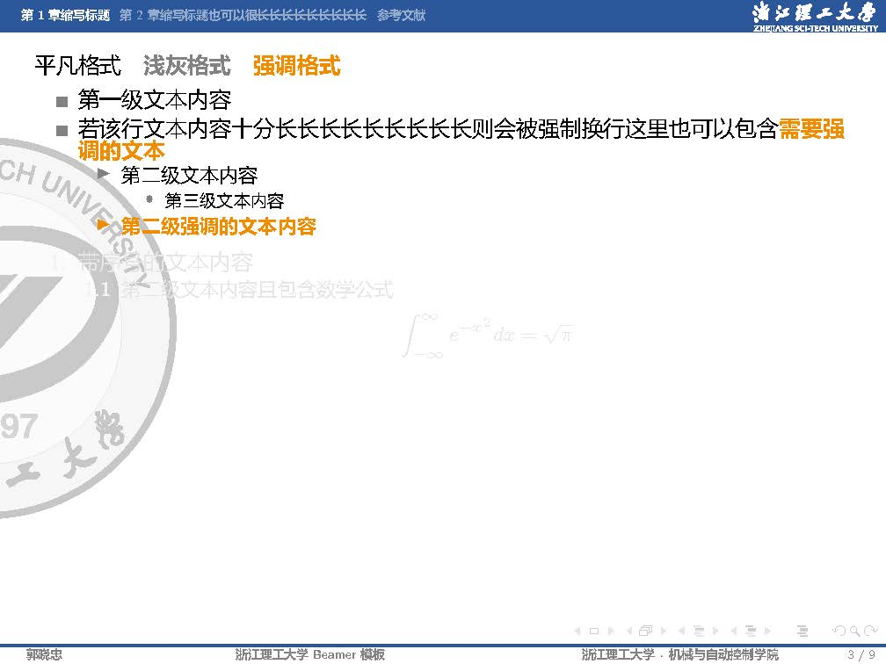
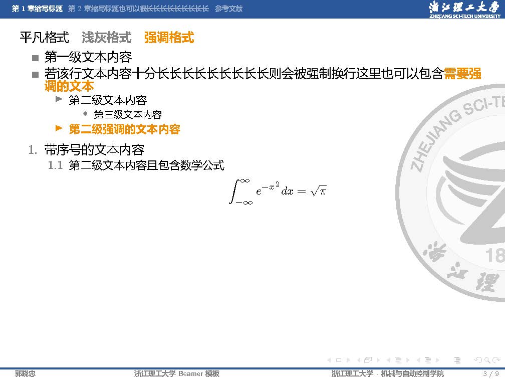
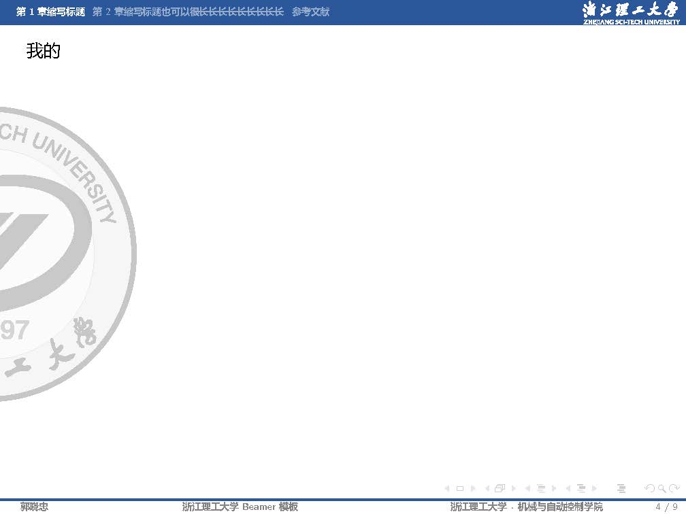
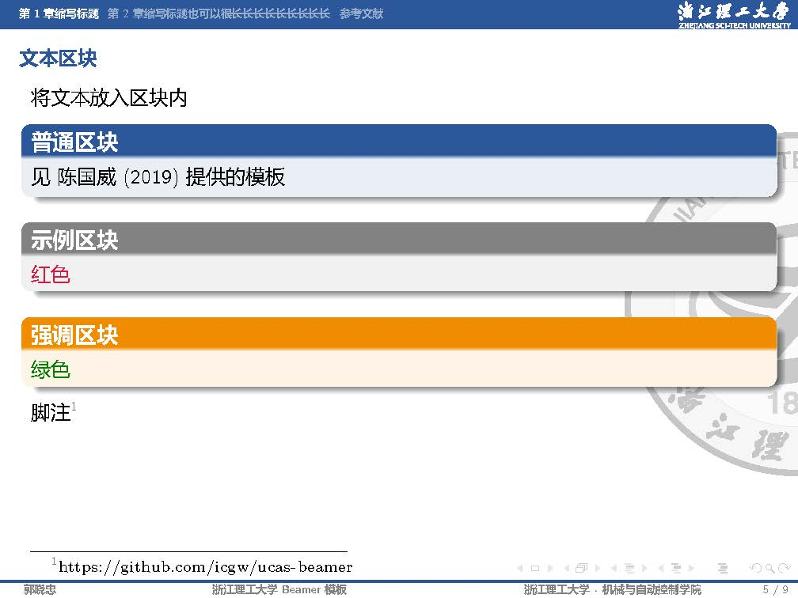
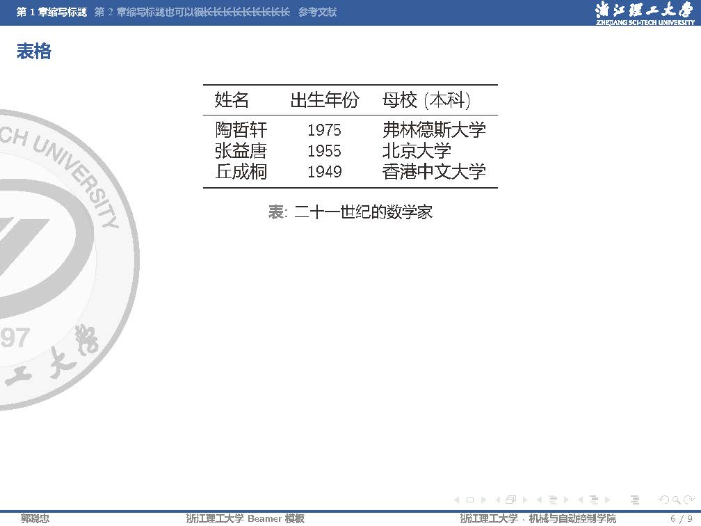
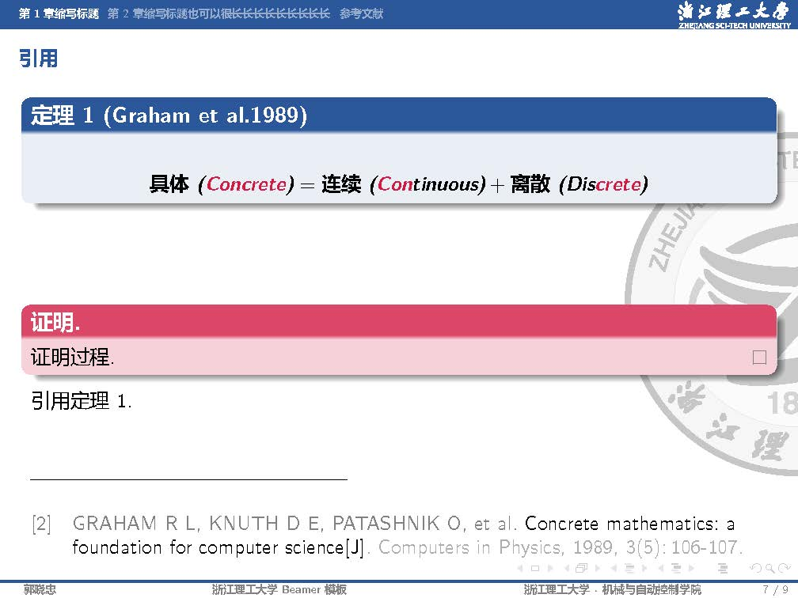
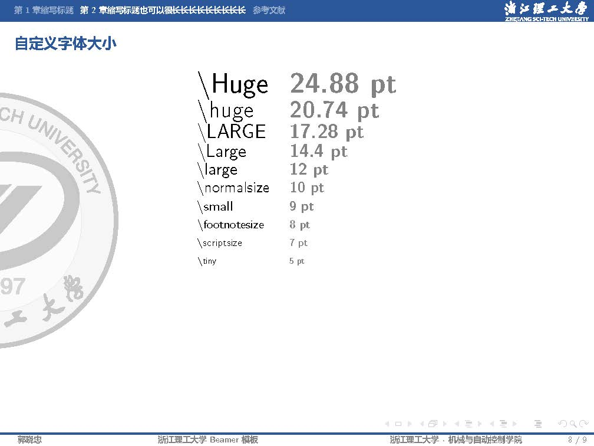
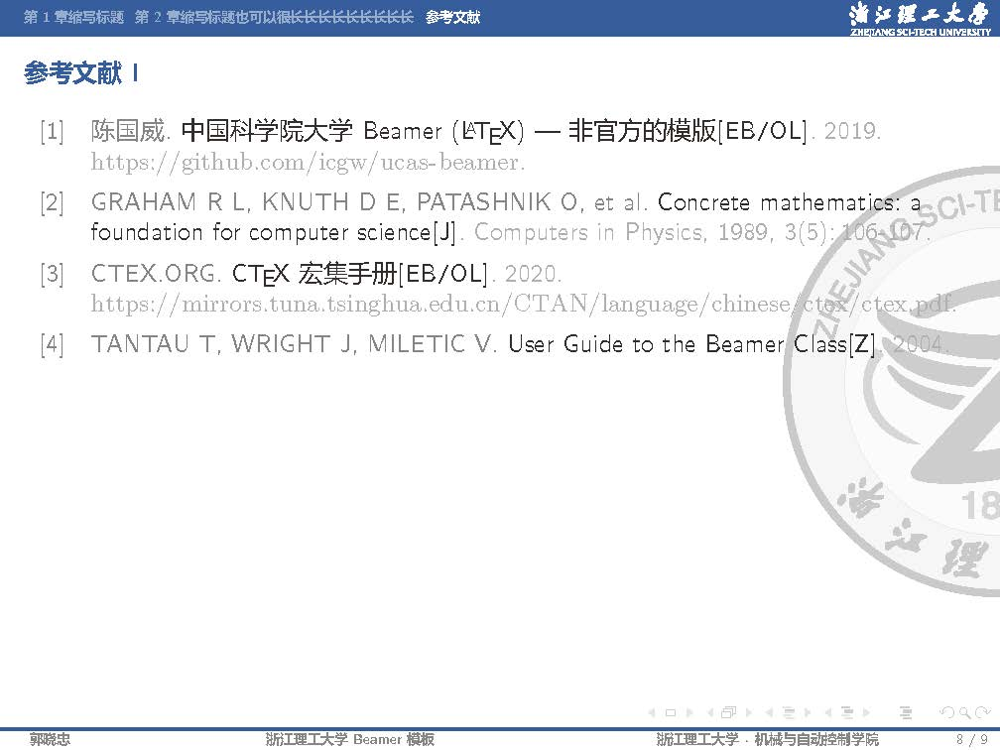
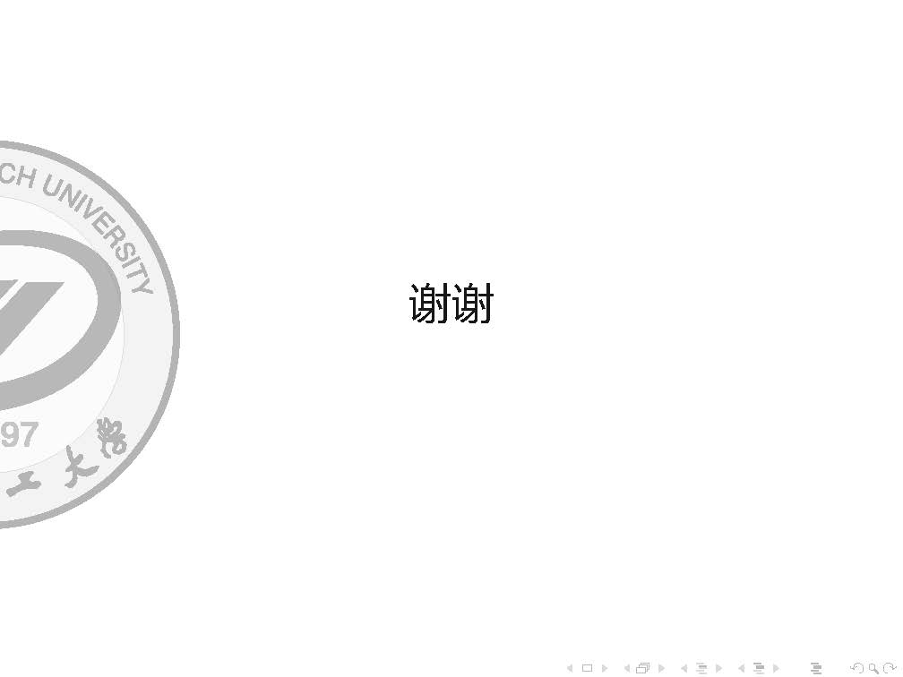

## 许可说明
 本作品采用<a rel="license" href="http://creativecommons.org/licenses/by-sa/4.0/">知识共享署名-相同方式共享 4.0 国际许可协议</a>进行许可。